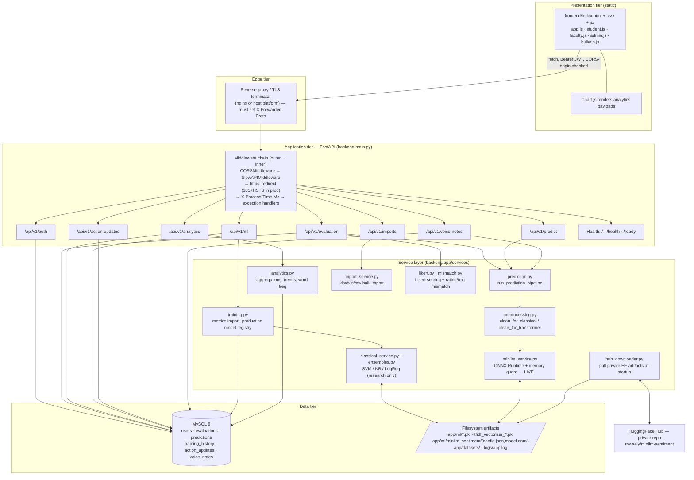
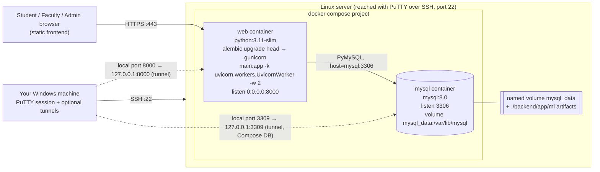
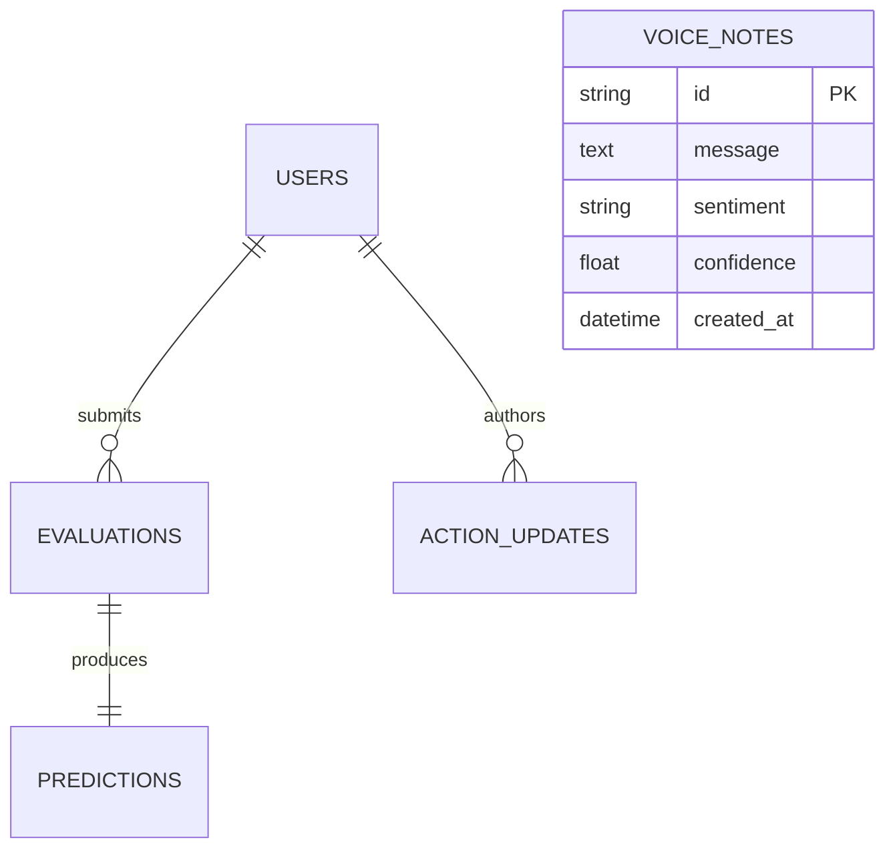
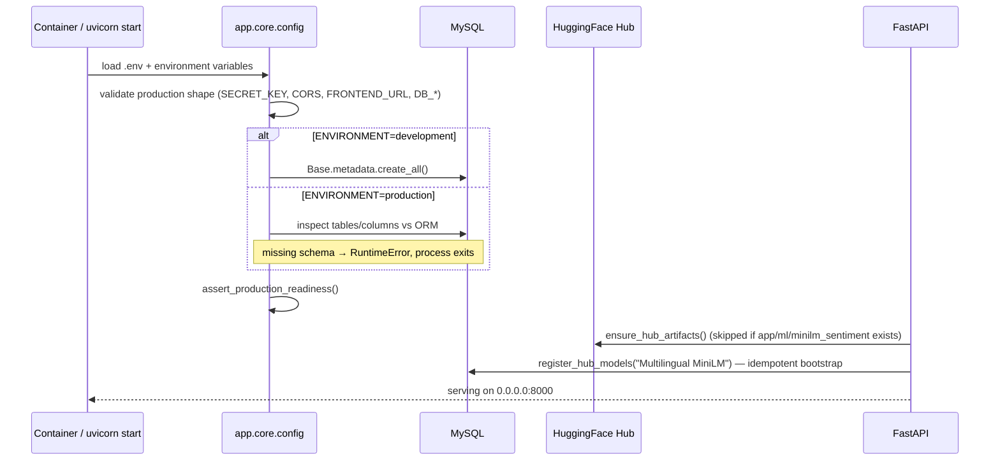
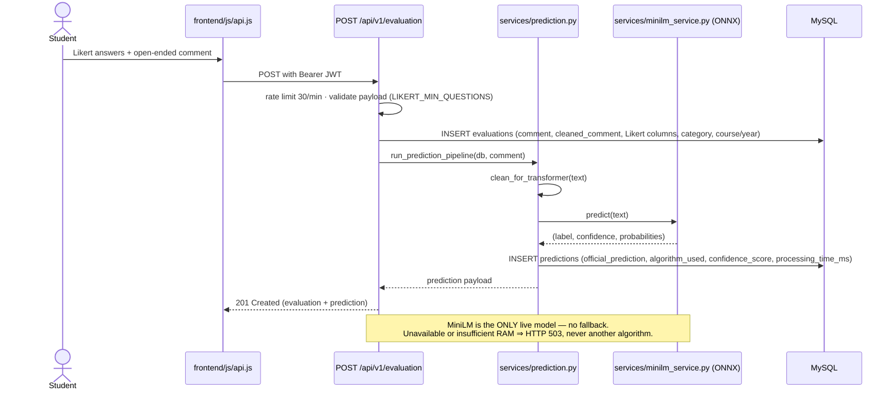
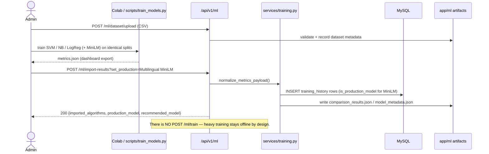

# Asiatech Student Sentiment Analysis System (SSAS) — System Architecture

**Project:** Sentiment Analysis of Student Feedback from Asia Technological School
of Science and Arts (Asiatech), Sta. Rosa, Laguna, Philippines
**Component documented:** `asiatech-sentiment-backend` (FastAPI API + static web client)
**Server access tool:** PuTTY (SSH from Windows → Linux host) — see
[§8 PuTTY working guide](#8-putty-working-guide-server-access--deployment)

Every statement below is derived from the repository source, not from a generic
template. File references are given so each claim can be re-checked.

---

## 1. What the system does (architectural summary)

A **three-tier web system** that collects student evaluations of Faculty, Staff,
Payment Services and School Facilities, runs each open-ended comment through a
**quantized multilingual MiniLM ONNX model**, stores the resulting sentiment
(Positive / Neutral / Negative), and exposes aggregate dashboards and reports to
Faculty and Administrators.

| Concern | Implementation |
| --- | --- |
| Web client | Static HTML5 + CSS3 + vanilla JS + Chart.js (`frontend/`) |
| API | FastAPI 0.115 on Uvicorn/Gunicorn (`backend/main.py`) |
| Business logic | Service layer (`backend/app/services/`) |
| Persistence | MySQL 8 via SQLAlchemy 2.0 + PyMySQL, schema by Alembic |
| Live inference | Multilingual MiniLM, INT8-quantized ONNX (`onnxruntime`) — **only** live model |
| Research baselines | SVM / Naive Bayes / Logistic Regression over TF-IDF (display/compare only) |
| Auth | JWT (HS256) issued by the API, bcrypt password hashing |
| Real-time prototype | Optional standalone Streamlit demo (`streamlit_app.py`) |

### 1.1 Architectural principles enforced in code

1. **One live model, no fallback.** `README.md` and `backend/docs/DIAGRAMS.md` state that
   classical TF-IDF models are offline research baselines; a failed MiniLM load
   returns HTTP 503 instead of silently serving another algorithm.
2. **Fail loudly at boot.** `main.py` refuses to start when production is
   mis-configured (`assert_production_readiness()` in `app/core/config.py`) and
   when the live DB schema is missing tables/columns the ORM expects.
3. **Fail loudly in the browser.** `frontend/js/utils.js:getApiBase()` has **no**
   hardcoded production fallback — a mis-deployed frontend throws instead of
   quietly posting student data to the wrong backend.
4. **Layer isolation.** Routers never touch the DB schema directly for analytics;
   they delegate to `app/services/*`, and ORM access goes through
   `app/core/database.py`. Schemas (`app/schemas/*`) are the only API contracts.
5. **Explicit trust boundary.** RBAC is a dependency (`app/api/deps.py`), not a
   per-endpoint `if` scattered through the routers.

---

## 2. Logical architecture (layers)



> Note: the API does **not** mount `StaticFiles` — there is no `app.mount(...)` in
> the codebase. The `frontend/` directory is served by a separate static host or
> by the reverse proxy, and `index.html` injects the backend URL via
> `window.ASIATECH_API_BASE` (`frontend/index.html:323`).

---

## 3. Deployment topology (as shipped, plus your PuTTY-managed host)

The repo supports two runtime shapes that share the same image/entry point:

* **Local development (Windows, what you are running now):** `python run.py`
  → Uvicorn on `0.0.0.0:8000`, `APP_RELOAD` honoured, tables auto-created
  (`Base.metadata.create_all` runs only when `ENVIRONMENT=development`).
* **Containerised / server deployment:** `docker compose up -d` → `mysql:8.0` +
  `web` (python:3.11-slim, Alembic `upgrade head`, then Gunicorn with 2
  Uvicorn workers). Identical `Dockerfile` is used by CI.

### 3.1 Container topology



### 3.2 Port matrix

| Port | Where | Purpose | Notes |
| --- | --- | --- | --- |
| 22/TCP | Server | SSH | The port PuTTY connects to |
| 8000/TCP | web container → host | FastAPI (`/`, `/health`, `/ready`, `/docs`, `/api/v1/...`) | Published by `docker-compose.yml` (`8000:8000`) |
| 3306/TCP | mysql container | MySQL wire protocol (intra-compose only) | App connects with `DB_HOST=mysql`, `DB_PORT=3306` |
| 3309/TCP | host | Host-side mapping of MySQL | `docker-compose.yml` publishes `3309:3306`; do **not** expose publicly |
| 80 / 443 | nginx (optional) | HTTP → HTTPS, static `frontend/`, proxy to `:8000` | Not in the repo — see §8.4 |
| 8501 | Streamlit (optional) | `streamlit_app.py` standalone MiniLM demo | Separate app, not part of the API |

### 3.3 What the app requires from the host

* **RAM:** MiniLM ONNX live inference is memory-gated. `MINILM_MIN_RAM_MB=900`
  by default (`app/core/config.py:381`), measured footprint ≈ 570–640 MB RSS;
  on a smaller instance every prediction fails with a clean 503 rather than
  OOM-killing the worker. Override with `MINILM_HOST_RAM_MB` on hosts that
  expose no cgroup limit.
* **CPU:** `TRANSFORMER_DEVICE=cpu` by default — no GPU required; a CUDA host is
  optional.
* **Disk:** persistent storage for the MySQL volume **and** `backend/app/ml/`
  (model artifacts) + `backend/app/datasets/` (admin uploads) + `backend/logs/`.
* **Egress:** HTTPS to `huggingface.co` on first boot when the private
  `rowseiy/minilm-sentiment` artifacts are not already on disk (`HF_TOKEN`).

---

## 4. Component inventory

### 4.1 Application tier — `backend/`

| Path | Responsibility |
| --- | --- |
| `main.py` | ASGI app factory: startup schema verification, lifespan (HF artifact bootstrap + model registry), middleware, exception handlers, health endpoints, router registration |
| `run.py` (repo root) | Dev launcher: puts `backend/` on `sys.path`, runs Uvicorn on `0.0.0.0:8000` |
| `app/core/config.py` | Pydantic settings (env + `backend/.env`), DB DSN builder, ML paths, production guard |
| `app/core/database.py` | Engine, `SessionLocal`, `get_db` dependency, `retry_on_disconnect` |
| `app/core/security.py` | Password hashing (bcrypt/passlib), JWT encode/decode |
| `app/core/limiter.py` | `slowapi` `Limiter` instance (in-memory storage) |
| `app/core/time.py` | Naive-UTC timestamp helper used by models |
| `app/api/deps.py` | `get_current_user`, `get_current_user_optional`, `require_admin`, `require_staff` |
| `app/api/auth.py` | Login, register, refresh, `/me`, profile, forgot/reset password (rate-limited 5/min, 10/min) |
| `app/api/evaluation.py` | Submit (30/min), list, get, delete, bulk delete, public config |
| `app/api/prediction.py` | On-demand sentiment prediction on a comment |
| `app/api/analytics.py` | Overall / category / monthly / daily / terms / courses / word-frequency / top complaints / appreciations / CSV export |
| `app/api/ml.py` | Dataset upload + validation, metrics import, comparison, confusion matrix, classification report, rollback, artifact download |
| `app/api/imports.py` | Bulk import of compiled `.xlsx/.xls/.csv` evaluation files (admin) |
| `app/api/action_updates.py` | Public bulletin read + admin CRUD for action updates |
| `app/api/voice_notes.py` | Anonymous "Voice in a Box" submissions + staff feed/stats/delete |
| `app/services/minilm_service.py` | ONNX Runtime session + fast tokenizer; the live classifier |
| `app/services/hub_downloader.py` | Pulls the private MiniLM repo from HuggingFace when artifacts are missing |
| `app/services/prediction.py` | Orchestrates preprocessing → MiniLM → `predictions` row |
| `app/services/analytics.py` | All aggregate SQL/derivations behind `/analytics` |
| `app/services/training.py` | Metrics normalisation, `training_history` writes, production-model selection, rollback |
| `app/services/import_service.py` | Row parsing/validation + bulk persistence for `/imports` |
| `app/services/preprocessing.py`, `likert.py`, `mismatch.py` | Text cleaning, Likert aggregation, rating-vs-text consistency check |
| `app/services/classical_service.py`, `ensembles.py`, `transformer_service.py` | Research/comparison model plumbing (never live) |
| `app/models/*` | ORM: `user.py`, `evaluation.py`, `prediction.py`, `training_history.py`, `action_update.py`, `voice_note.py` |
| `app/schemas/*` | Request/response contracts (auth, evaluation, prediction, analytics, ml, import results, voice notes, action updates) |
| `app/utils/{logger,email}.py` | Loguru logging to `logs/app.log`, reset-mail helper |
| `alembic/versions/0001…0016+` | Schema history (initial schema → enum alignment → likert/mismatch → action updates → voice notes → legacy column retirement) |
| `scripts/` | Operational tooling: `create_admin.py`, `train_models.py`, `generate_model_artifacts.py`, `resave_models.py`, `e2e_voice_notes.py` |
| `tests/` | Pytest suite (hermetic SQLite, MiniLM stubbed) |

### 4.2 Presentation tier — `frontend/`

| File | Role |
| --- | --- |
| `index.html` | Single-page shell; declares `window.ASIATECH_API_BASE` |
| `js/utils.js` | `getApiBase()` (explicit override → localhost dev → throw), form builders, formatting |
| `js/api.js` | `API` client: token storage in `localStorage`, `fetch` wrapper, per-domain endpoint methods |
| `js/app.js`, `student.js`, `faculty.js`, `admin.js`, `bulletin.js` | Role-specific views and RBAC-aware navigation |
| `css/style.css` | Theme, layout, responsive rules |

### 4.3 Supporting / optional

| File | Role |
| --- | --- |
| `Dockerfile` | python:3.11-slim image (build tools + `default-libmysqlclient-dev`), installs `backend/requirements.txt`, runs Alembic then Gunicorn |
| `docker-compose.yml` | `mysql:8.0` + `web` with healthchecks, named volume, `restart: unless-stopped` |
| `.github/workflows/ci.yml` | Compose build/up smoke test, MySQL health wait, then `pytest -q` on the runner (SQLite, `ENVIRONMENT=development`) |
| `backend/docs/DIAGRAMS.md` | ER diagram, architecture diagram, submission/import sequence diagrams (Mermaid) |
| `backend/docs/postman_collection.json` | Importable Postman collection for every endpoint |
| `streamlit_app.py` | Self-contained Streamlit UI for the MiniLM model only (separate deploy; not part of the API) |
| `finetune_transformer.py`, `train.csv`, `val.csv`, `test.csv` | Offline fine-tuning / research dataset inputs |

---

## 5. Security & access-control architecture

| Control | Implementation |
| --- | --- |
| Identity | `users` record; login by e-mail or student number; `is_active` gate |
| Credentials | bcrypt via passlib; reset tokens via `forgot-password` / `reset-password` (rate-limited 5/min and 10/min) |
| Session | JWT bearer, `HS256`; `ACCESS_TOKEN_EXPIRE_MINUTES` (default 1440) / `REFRESH_TOKEN_EXPIRE_MINUTES` (default 10080) |
| Roles | `UserRole`: `STUDENT`, `ADMINISTRATOR`, `FACULTY` |
| Authorization | `require_admin` (destructive + ML endpoints), `require_staff` (analytics/dashboards/bulletin feed); students see only their own submissions |
| Rate limiting | SlowAPI: default `100/minute`, `/predict` `20/minute`, auth `10/minute`, evaluation submit `30/minute` |
| Transport | With `ENVIRONMENT=production`, HTTP is 301-redirected to HTTPS and responses carry HSTS; `X-Forwarded-Proto` is respected behind a TLS proxy |
| CORS | `CORS_ORIGINS` allow-list only; wildcard and localhost origins are **rejected at boot** in production. CORS middleware is registered **last** (outermost) so even error responses carry CORS headers |
| Startup guard | `assert_production_readiness()` + `validate_production_environment_shape()` fail the boot on `DEBUG=true`, default `SECRET_KEY`, wildcard/localhost CORS or a localhost `FRONTEND_URL` |
| Schema guard | Production boot verifies every ORM table/column exists, raising an actionable "run `alembic upgrade head`" error |
| Data separation | `voice_notes` are identity-free and deliberately excluded from evaluation/KPI aggregates |

---

## 6. Data architecture

### 6.1 Core entities



`training_history` is intentionally **not** FK-linked to evaluations/predictions —
it records model training runs (`algorithm`, `status`, metrics, `confusion_matrix`,
`classification_report`, `hyperparameters`, `is_production_model`) independently of
student data. Full column-level ER diagram: `backend/docs/DIAGRAMS.md`.

### 6.2 Persistence rules

* **Migrations are the source of truth** — `alembic upgrade head` is part of the
  container start command (`docker-compose.yml`), so a redeploy can never serve a
  stale schema.
* Development only: `Base.metadata.create_all(bind=engine)` runs when
  `ENVIRONMENT=development` (`main.py`). Production never does this.
* The API supports two drivers via `DB_DRIVER`: `mysql+pymysql` (default,
  production) and `sqlite` (tests/CI). `DATABASE_URL` overrides the component
  `DB_*` settings when supplied; credentials are escaped through
  `sqlalchemy.engine.URL.create`.
* `retry_on_disconnect()` wraps analytics/export reads so a recycled MySQL
  connection (common with managed/proxied DBs) is retried instead of surfacing a 500.

### 6.3 File storage

| Path | Contents | Persistence requirement |
| --- | --- | --- |
| `backend/app/ml/*.pkl` + `tfidf_vectorizer_*.pkl` | Classical research models | Survive redeploys (or restore from HF/artifacts) |
| `backend/app/ml/minilm_sentiment/` | `config.json`, `tokenizer.json`, `model.onnx` (INT8) | **Required for `/ready` and all live predictions** |
| `backend/app/datasets/` | Admin-uploaded training datasets | Volume or object store |
| `backend/logs/app.log` | Rotated Loguru log | Ship to log aggregation; persist for audits |
| `backend/*.db` | Local SQLite dev DBs (`app.db`, `asiatech_sentiment.db`) | Dev-only artifacts — not for deployment |

---

## 7. Runtime flows

### 7.1 Startup / boot sequence



### 7.2 Student submits an evaluation (core business flow)



### 7.3 Admin imports research results and compares models



### 7.3.1 Metrics JSON import contract (`metrics_json`)

Transport: `POST /api/v1/ml/import-results`, administrator bearer token,
`multipart/form-data` with a single file part named **`metrics_json`**; optional
`set_production` **query parameter**; hard **2 MB** cap (413 beyond that, 400 on
unparseable JSON, 422 when nothing resolves). A validated example ships at
`backend/docs/sample_metrics_export.json`.

Two payload shapes are accepted by `normalize_metrics_payload()`:

| Shape | Skeleton | Notes |
| --- | --- | --- |
| **A — Colab `dashboard_export.json`** | `{"label_map": {...}, "recommended_production_model": "...", "models": {"svm": {...}, "naive_bayes": {...}, "logistic_regression": {...}, "minilm": {...}}}` | Chosen whenever `models` is an object. |
| **B — flat rows** (admin UI / tests) | `{"rows": {"SVM": {...}, "Naive Bayes": {...}, "Logistic Regression": {...}, "Multilingual MiniLM": {...}}, "best_model": "Multilingual MiniLM"}` | Read only when `models` is absent. Keys must already be canonical or match an alias. |

Model keys are canonicalized by `colab_key_to_approach()` (lowercased, non
alphanumerics stripped): `svm|svc|supportvectormachine` → **SVM**;
`naivebayes|nb|multinomialnb` → **Naive Bayes**;
`logisticregression|logreg|lr` → **Logistic Regression**; any key containing
`minilm` → **Multilingual MiniLM**; anything else is skipped with a warning in
`app.log`. Values in `APPROVED_APPROACHES` are the only ones persisted.

Per-model field mapping performed by `_normalize_colab_model()`:

| Export field | Destination | Behaviour |
| --- | --- | --- |
| `accuracy` | `TrainingHistory.accuracy` + report | verbatim |
| `precision_weighted` (fallback `precision`) | `.precision` | first non-empty wins |
| `recall_weighted` (fallback `recall`) | `.recall` | first non-empty wins |
| `weighted_f1` (fallback `f1_score`) | `.f1_score` / `.weighted_f1` | `weighted_f1` column stays NULL if only `f1_score` is supplied |
| `macro_f1` | `.macro_f1` | verbatim |
| `per_class.<label>.{precision,recall,f1,support}` | `.classification_report` | key must be `f1` (not `f1-score`); `macro avg` is derived as the mean per-class F1 |
| `confusion_matrix` | `.confusion_matrix` (`{"labels": [...], "matrix": [...]}`) | stored verbatim; the server supplies the labels, so the 3x3 order **must** be Negative, Neutral, Positive |
| `training_time_seconds`, `inference_time_ms`, `memory_usage_mb` | matching columns | optional |
| `hyperparameters` | `.hyperparameters` | optional free-form object |

`label_map` supplies the class labels; a dict contributes its **values**
(`{"0":"Negative"}` → `Negative`), a list contributes its items, and an absent
map falls back to `CLASS_ORDER` = Negative, Neutral, Positive.

Invariants this contract preserves:

1. **Production cannot be imported.** `set_production`/`recommended_model` are
   advisory only: `_mark_production_model(MINILM)` runs unconditionally, so
   `production_model` in the response is always `Multilingual MiniLM`, and the
   best-scoring imported approach is surfaced as `recommended_model`. `POST
   /ml/rollback` likewise rejects anything but MiniLM (409).
2. **Metrics only, never weights.** No model archive is uploaded; the live ONNX
   artifacts are pulled from the private Hugging Face Hub at boot. The 2 MB cap
   and the 413 message exist precisely to prevent weight-archive uploads.
3. **Empty imports are rejected transactionally** — if no approved approach
   resolves, the session is rolled back and a 422 is returned, so a bad export
   cannot leave partial `training_history` rows behind.
4. `artifacts_updated` in the response is currently always `[]`; the DB is the
   source of truth for metrics. The `app/ml/*.json` artifacts are rewritten by
   the offline CLI path (`scripts/train_models.py`,
   `scripts/generate_model_artifacts.py`).

### 7.4 Health & observability contract

| Endpoint | Semantics | Consumer |
| --- | --- | --- |
| `GET /` | Liveness metadata (project, version, docs link) | Humans / smoke tests |
| `GET /health` | Process liveness (`{"status":"healthy"}`) | `docker-compose` healthcheck, load balancer |
| `GET /ready` | Dependency readiness: DB `SELECT 1` **and** presence of `minilm_sentiment/config.json` + `model.onnx`; returns 503 with a per-dependency breakdown when not ready | Deployment monitoring / your PuTTY smoke test |
| `X-Process-Time-Ms` | Per-response latency header | Perf debugging |
| `backend/logs/app.log` | Structured, rotated application log (Loguru) | Log shipping / audit |

---

## 8. PuTTY working guide (server access & deployment)

PuTTY is your SSH client from Windows; the server side is a Linux host. Everything
below maps to the architecture above — none of it requires repository changes.

### 8.1 Session setup (connect to the API/database host)

**Session**

| Field | Value |
| --- | --- |
| Host Name (or IP address) | your server's public IP / DNS name |
| Port | `22` (or the provider's SSH port) |
| Connection type | **SSH** |
| Saved Sessions | e.g. `SSAS-prod` → **Save** (reload in one click next time) |

**First connection:** compare the host-key fingerprint with the one your provider
shows, then **Accept** (PuTTY caches it per host).

**Authentication (Connection → SSH → Auth)**

* *Preferred:* public key. PuTTY requires **`.ppk`** format — open **PuTTYgen**,
  **Load** the private key, then **Save private key** as e.g. `ssas-deploy.ppk`.
  Point *Private key file for authentication* at it, or load it into **Pageant**
  once and enable *Attempt authentication using Pageant*.
* *Alternative:* username + password at the login prompt.

**Keep the session alive (Connection)**

* *Seconds between keepalives* = `30`–`60` (prevents idle NAT/proxy timeouts
  during long `docker compose build` runs).
* Tick *Enable TCP keepalives*.

**Logging (Session → Logging)** — select *All session output* and a file such as
`deploy-2026-09-25.log`. This yields a timestamped transcript of each deploy,
restart and verification command (convenient as documentation/evidence).

### 8.2 Tunnels — verify the API without exposing port 8000

**Connection → SSH → Tunnels**, add each mapping, then **Open** (and Save the
session so the tunnels persist):

| Source | Destination | Type | Then open in your browser |
| --- | --- | --- | --- |
| `8000` | `127.0.0.1:8000` | Local (Auto) | <http://localhost:8000/docs> — Swagger UI |
| `8000` | `127.0.0.1:8000` | Local (Auto) | <http://localhost:8000/ready> — readiness |
| `3309` | `127.0.0.1:3309` | Local (Auto) | MySQL Workbench/DBeaver → `127.0.0.1:3309` (Docker-published DB) |
| `3306` | `127.0.0.1:3306` | Local (Auto) | Same, when MySQL runs directly on the host |

Because a tunnel terminates on the server's loopback, you can keep the firewall
closed:

```bash
sudo ufw allow 22/tcp       # SSH (PuTTY)
sudo ufw allow 80,443/tcp   # only if nginx terminates TLS
# leave 8000 and 3309/3306 closed — reach them through the PuTTY tunnel
sudo ufw enable && sudo ufw status verbose
```

> `docker-compose.yml` publishes MySQL as `"3309:3306"` on **all** interfaces. If
> the host is internet-reachable and the firewall is off, that port is exposed.
> Prefer `"127.0.0.1:3309:3306"`, or rely on UFW + the PuTTY tunnel.

### 8.3 PuTTY usability notes (Windows)

* **Paste** = right-click in the terminal (or `Shift+Insert`). **Copy** = select text
  with the mouse (selection copies it), or press `Ctrl+Insert`.
* `Ctrl+C` in PuTTY sends **SIGINT to the remote process** — exactly what you want
  to stop `docker compose logs -f`, but it is *not* "copy".
* Drag & drop does not upload files. Use **pscp** / **plink**, which ship with PuTTY:

  ```powershell
  # upload the static frontend to an nginx docroot
  pscp -i C:\keys\ssas-deploy.ppk -r .\frontend user@server:/var/www/ssas
  # run a command non-interactively (scripted deploy from Windows)
  plink -i C:\keys\ssas-deploy.ppk user@server "cd /opt/ssas && git pull && docker compose up -d --build"
  ```

* **Serial console** (provider consoles that are COM-based): Session → Connection
  type **Serial**, *Serial line* `COM3`, *Speed* `115200`, 8 data bits, no parity,
  1 stop bit, flow control `None` (or RTS/CTS). Useful when the network — and thus
  SSH — is unavailable.

### 8.4 Deployment runbook on the host (over your PuTTY session)

**Option A — Docker Compose (matches `docker-compose.yml`, recommended)**

```bash
# 1. Get the code
cd /opt && sudo git clone https://github.com/rowseiyyyy/Student-Sentiment-Analysis-System.git ssas
cd /opt/ssas && git checkout fix/audit-top3-hardening

# 2. Create the environment file (never commit real secrets)
cp backend/.env.example backend/.env
nano backend/.env      # ENVIRONMENT=production, DEBUG=false,
                       # SECRET_KEY=$(openssl rand -hex 32),
                       # DB_HOST=mysql, DB_PORT=3306, DB_USER, DB_PASSWORD,
                       # DB_NAME=asiatech_sentiment_db,
                       # CORS_ORIGINS=https://<frontend-domain>,
                       # FRONTEND_URL=https://<frontend-domain>,
                       # HF_TOKEN=hf_xxx (private MiniLM repo), TRANSFORMER_DEVICE=cpu

# 3. Build + start (MySQL health → alembic upgrade head → gunicorn)
sudo docker compose up -d --build

# 4. Verify
sudo docker compose ps
sudo docker compose logs --tail 100 web
curl -s http://127.0.0.1:8000/health   # {"status":"healthy"}
curl -s http://127.0.0.1:8000/ready    # database connected + models ready
```

**Option B — bare-metal venv + Gunicorn + systemd (no Docker)**

```bash
sudo apt update && sudo apt install -y python3.11 python3.11-venv mysql-client
cd /opt/ssas && python3.11 -m venv .venv && . .venv/bin/activate
pip install -r backend/requirements.txt
cd backend && cp .env.example .env && nano .env && alembic upgrade head
```

`/etc/systemd/system/ssas-api.service`:

```ini
[Unit]
Description=Asiatech SSAS API (FastAPI)
After=network.target

[Service]
User=ssas
WorkingDirectory=/opt/ssas/backend
EnvironmentFile=/opt/ssas/backend/.env
ExecStart=/opt/ssas/.venv/bin/gunicorn main:app \
  --workers 2 --worker-class uvicorn.workers.UvicornWorker \
  --bind 127.0.0.1:8000 --timeout 120
Restart=always
RestartSec=5

[Install]
WantedBy=multi-user.target
```

```bash
sudo systemctl daemon-reload && sudo systemctl enable --now ssas-api
sudo systemctl status ssas-api --no-pager
sudo journalctl -u ssas-api -n 100 --no-pager
```

**Reverse proxy + TLS (nginx) — required for the app's HTTPS rule**

The app 301-redirects HTTP and emits HSTS when `ENVIRONMENT=production`, so nginx
must terminate TLS **and** send the original scheme:

```nginx
server {
    listen 443 ssl http2;
    server_name api.asiatech.example;

    ssl_certificate     /etc/letsencrypt/live/api.asiatech.example/fullchain.pem;
    ssl_certificate_key /etc/letsencrypt/live/api.asiatech.example/privkey.pem;

    # static frontend
    root /var/www/ssas;
    index index.html;

    # API
    location /api/ {
        proxy_pass http://127.0.0.1:8000;
        proxy_set_header Host              $host;
        proxy_set_header X-Real-IP         $remote_addr;
        proxy_set_header X-Forwarded-For   $proxy_add_x_forwarded_for;
        proxy_set_header X-Forwarded-Proto $scheme;   # keeps HTTPS detection correct
        proxy_read_timeout 120s;                      # MiniLM first-load can be slow
    }

    location /health { proxy_pass http://127.0.0.1:8000; proxy_set_header X-Forwarded-Proto $scheme; }
    location /ready  { proxy_pass http://127.0.0.1:8000; proxy_set_header X-Forwarded-Proto $scheme; }
    location /docs   { proxy_pass http://127.0.0.1:8000; proxy_set_header X-Forwarded-Proto $scheme; }
}

server {
    listen 80;
    server_name api.asiatech.example;
    return 301 https://$host$request_uri;
}
```

Finally point the web client at the proxy — `frontend/index.html`:

```html
<script>
    window.ASIATECH_API_BASE = 'https://api.asiatech.example/api/v1';
</script>
```

> `frontend/index.html:323` currently points at the Render deployment
> (`https://student-sentiment-analysis-system.onrender.com/api/v1`). Update it (and
> `CORS_ORIGINS`) together whenever you self-host behind PuTTY-managed nginx.

---

## 9. Configuration reference (environment variables)

Settings load from the process environment first, then `backend/.env`
(`app/core/config.py`). Production-critical values are validated at import time.

| Variable | Required in prod | Default / behaviour |
| --- | --- | --- |
| `ENVIRONMENT` | ✅ | `development`; `production` activates the HTTPS redirect, the boot guard and the schema check |
| `DEBUG` | ✅ | `false` (must be `false` in production; `release`/`production` strings also normalise to `false`) |
| `SECRET_KEY` | ✅ | **No default** — the app fails to start without it; default-looking values are rejected in production |
| `DB_HOST`, `DB_PORT`, `DB_USER`, `DB_PASSWORD`, `DB_NAME` | ✅ | Used to build the SQLAlchemy DSN (`URL.create`, credentials escaped) |
| `DB_DRIVER` | ❌ | `mysql+pymysql`; `sqlite` for tests/CI |
| `DATABASE_URL` | ❌ | Overrides the `DB_*` components entirely (useful for managed DBs) |
| `CORS_ORIGINS` | ✅ | Comma-separated or JSON list; must be the exact public frontend origin(s) — wildcard/localhost rejected in production |
| `FRONTEND_URL` | ✅ | Must not be localhost in production |
| `ACCESS_TOKEN_EXPIRE_MINUTES` / `REFRESH_TOKEN_EXPIRE_MINUTES` | ❌ | `1440` / `10080` |
| `ALGORITHM` | ❌ | `HS256` |
| `RATE_LIMIT_DEFAULT` / `_PREDICT` / `_AUTH` | ❌ | `100/minute`, `20/minute`, `10/minute` |
| `LIKERT_MIN_QUESTIONS` | ❌ | `5` (server-side floor for rating submissions) |
| `LOW_CONFIDENCE_THRESHOLD` | ❌ | `0.5` (Overview "low confidence" flag) |
| `HF_TOKEN` | ✅ (fresh host) | Read token for the private `rowseiy/minilm-sentiment` repo; empty ⇒ hub download skipped |
| `HF_MINILM_REPO`, `HF_PRODUCTION_MODEL`, `MINILM_ONNX_FILE`, `MINILM_MODEL_NAME`, `MINILM_MAX_SEQ_LENGTH` | ❌ | `rowseiy/minilm-sentiment`, `Multilingual MiniLM`, `model.onnx`, `sentence-transformers/paraphrase-multilingual-MiniLM-L12-v2`, `128` |
| `ENABLE_MINILM_INFERENCE` | ❌ | `true`; `false` ⇒ all predictions return 503 (no fallback model by design) |
| `MINILM_MIN_RAM_MB` | ❌ | `900` — refuse inference on smaller hosts instead of OOM-crashing |
| `MINILM_HOST_RAM_MB` | ❌ | unset ⇒ auto-detect; `0` ⇒ no limit |
| `TRANSFORMER_DEVICE` | ❌ | `cpu` (`cuda` where available) |
| `TEST_SIZE`, `RANDOM_STATE`, `BOOTSTRAP_*`, `ACADEMIC_TERM_MONTHS` | ❌ | Research/analytics parameters (bootstrap CI, academic-term buckets) |

---

## 10. Architectural constraints, risks & known gaps

These are properties of the current design worth knowing before you scale it on a
PuTTY-managed box:

1. **Rate limits are per-process and in-memory.** `slowapi` uses default storage
   (`app/core/limiter.py`), so with the shipped 2 Gunicorn workers a client can
   consume up to ~2× the configured window, and limits reset on restart. Multi-node
   deployments need a Redis `storage_uri`.
2. **MiniLM is a single point of failure by design.** No fallback model exists:
   wrong RAM sizing (`MINILM_MIN_RAM_MB`), missing artifacts, or a corrupted ONNX
   file turns every prediction into a 503. `/ready` is the early-warning signal.
3. **Gunicorn workers each load the ONNX model** (~570–640 MB RSS per worker). Plan
   **≥ 2 GB RAM for 2 workers**; measure before adding workers.
4. **The frontend is not served by FastAPI.** There is no `StaticFiles` mount, so a
   deployment must independently host `frontend/` and set `window.ASIATECH_API_BASE`
   to the API origin (which must also appear in `CORS_ORIGINS`).
5. **The deployed frontend still references the Render API**
   (`frontend/index.html:323`). Until both this and `CORS_ORIGINS` are changed, a
   self-hosted backend behind nginx will not be reachable from the browser.
6. **No infrastructure-as-code in the repo.** The nginx server block, systemd unit,
   TLS certificates and firewall rules in §8.4 are operational additions, not files
   in the repository; there is also no CD job in `.github/workflows/ci.yml` (CI
   builds/tests only).
7. **MySQL is published to the host network.** `docker-compose.yml` maps
   `3309:3306` without a bind address — tighten to `127.0.0.1:3309:3306` on an
   internet-facing host.
8. **Password reset is not fully production-ready.** `DEPLOYMENT.md` §5 requires a
   real mail provider and forbids exposing reset tokens in API responses.
9. **`streamlit_app.py` is a parallel prototype**, not part of the API tier — its
   docstring references `requirements-streamlit.txt`, which is not present in the
   repo. Treat it as optional/demo only.
10. **Local SQLite files** (`backend/app.db`, `backend/asiatech_sentiment.db`,
    `YOUR_DB_FILE.db`, root `test.csv`/`train.csv`/`val.csv`) are development and
    research artifacts; do not point a production deployment at them.
11. **Single-database, single-region design.** No read replicas, caching layer or
    queue: analytics queries hit MySQL directly (mitigated by `retry_on_disconnect`
    and index-backed aggregation). If dashboards get slow, add caching before
    adding replicas.

---

## 11. Post-deployment verification checklist (run over PuTTY)

```bash
# 1. Processes / containers
sudo docker compose ps                 # or: sudo systemctl status ssas-api --no-pager

# 2. Liveness + readiness (readiness proves DB AND MiniLM artifacts)
curl -s http://127.0.0.1:8000/          | python3 -m json.tool
curl -s http://127.0.0.1:8000/health    | python3 -m json.tool
curl -s http://127.0.0.1:8000/ready     | python3 -m json.tool   # expect models: ready

# 3. Schema is current
cd /opt/ssas/backend && alembic current && alembic heads

# 4. Logs are clean (no PRODUCTION GUARD / schema errors)
sudo docker compose logs --tail 200 web | grep -iE "guard|error|traceback" || echo "clean"

# 5. Model artifacts present and non-empty
ls -lh app/ml/minilm_sentiment/config.json app/ml/minilm_sentiment/model.onnx

# 6. End-to-end through the proxy (once nginx + DNS are set)
curl -s https://api.asiatech.example/ready | python3 -m json.tool
```

Browser-side checks (through your PuTTY tunnel at <http://localhost:8000/docs>, or
the real domain):

1. `POST /api/v1/auth/login` returns an access token.
2. `POST /api/v1/evaluation` with a comment returns **201** and a sentiment label.
3. The admin dashboard shows the aggregate panels; `/analytics/export/csv` downloads.
4. `/` on the frontend loads with no "API base URL is not configured" error in the
   console (proves `window.ASIATECH_API_BASE` and `CORS_ORIGINS` agree).

## 12. Document map

| Question | Read |
| --- | --- |
| System architecture (this document) | `SYSTEM_ARCHITECTURE.md` |
| ER diagram, sequence diagrams, model flows | `backend/docs/DIAGRAMS.md` |
| Production deployment rules & release gate | `DEPLOYMENT.md` |
| Features, endpoints, training workflow, dev guide | `backend/README.md`, `README.md` |
| Live endpoint contract | `/docs` (Swagger) on the running API |
| API requests to replay | `backend/docs/postman_collection.json` |
| Metrics JSON import example | `backend/docs/sample_metrics_export.json` |

---

*PuTTY-specific sections (§8, §11) describe operational wiring only; they require
no source changes. Everything else maps to files in this repository, pinned to
commit `bf1f938` on branch `fix/audit-top3-hardening`.*

