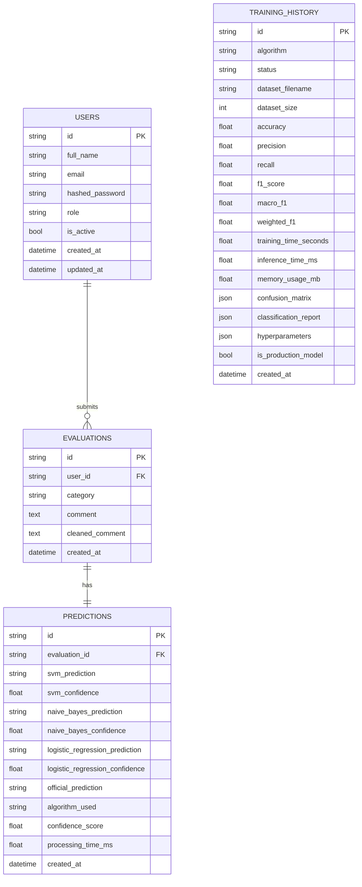
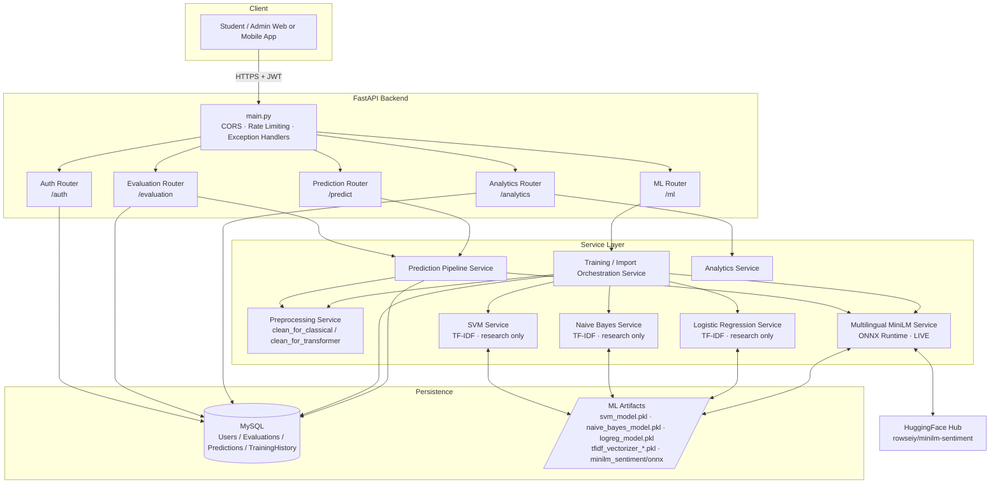
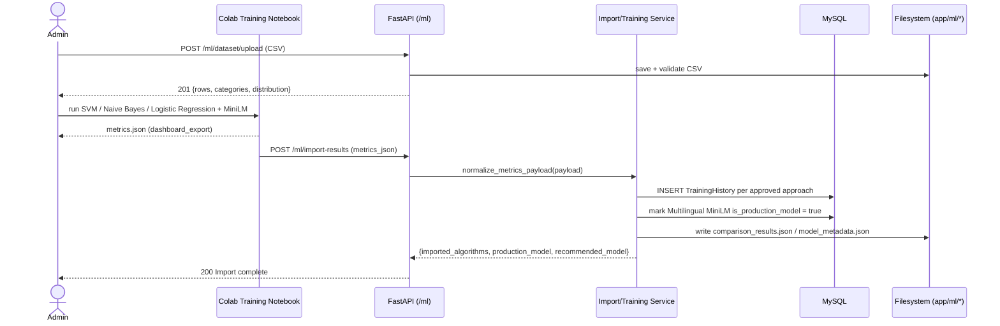

# System Diagrams

These diagrams use [Mermaid](https://mermaid.js.org/) syntax. They render
automatically on GitHub/GitLab, in most modern Markdown viewers, and in
the [Mermaid Live Editor](https://mermaid.live).

---

## 1. ER Diagram



> `training_history` is intentionally not linked by foreign key to
> `evaluations` / `predictions` — it tracks model training runs
> independently of individual student submissions.

---

## 2. Architecture Diagram



---

## 3. Sequence Diagram — Student Submits an Evaluation

```mermaid
sequenceDiagram
    actor Student
    participant API as FastAPI (/evaluation)
    participant Pipeline as Prediction Pipeline Service
    participant MiniLM as Multilingual MiniLM Service (ONNX)
    participant DB as MySQL

    Student->>API: POST /evaluation {category, comment}
    API->>DB: INSERT Evaluation
    API->>Pipeline: run_prediction_pipeline(db, comment)

    Pipeline->>DB: get_production_algorithm(db) → Multilingual MiniLM
    Pipeline->>Pipeline: clean_for_transformer(text)
    Pipeline->>MiniLM: predict(text)
    MiniLM-->>Pipeline: (label, confidence, probabilities)

    Note over Pipeline,MiniLM: MiniLM is the ONLY live model — there is no
    inference fallback. If it cannot serve, the request fails with HTTP 503.

    Pipeline-->>API: {official_prediction, algorithm_used, confidence_score}
    API->>DB: INSERT Prediction (research columns NULL + official result)
    API-->>Student: 201 Created (Evaluation + Prediction)
```

---

## 4. Sequence Diagram — Admin Imports Training Results & Compares Models



> There is no `POST /ml/train` endpoint — heavy training runs outside the
> API (Colab or `scripts/train_models.py`) and only the resulting metrics
> are imported. Research approaches are **display-only**; MiniLM always
> remains the live production model.
