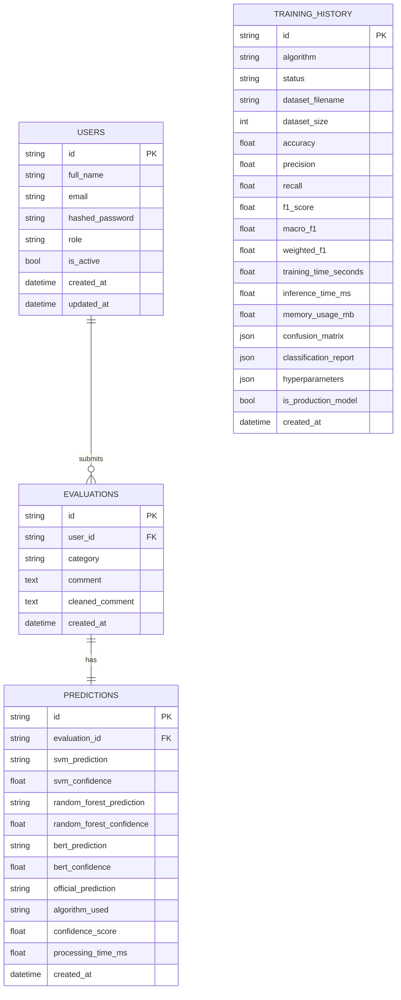
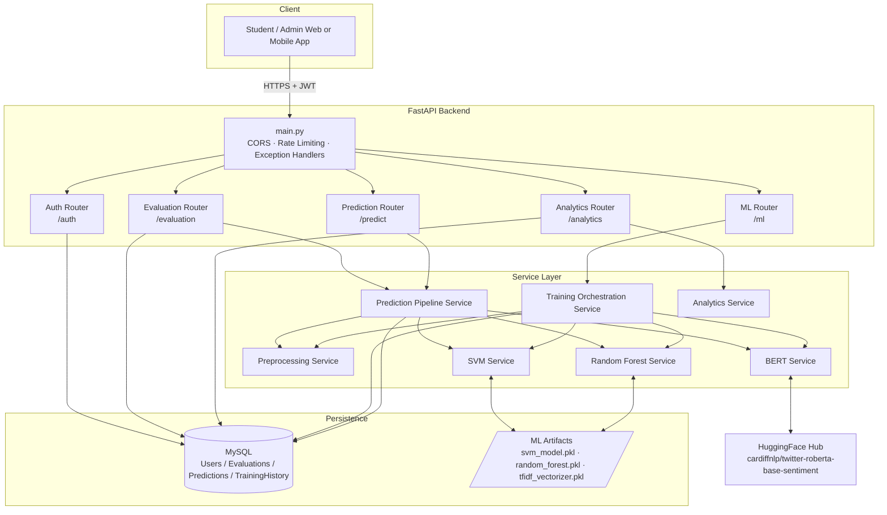
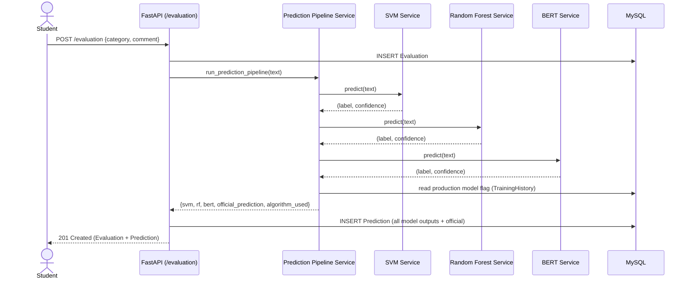
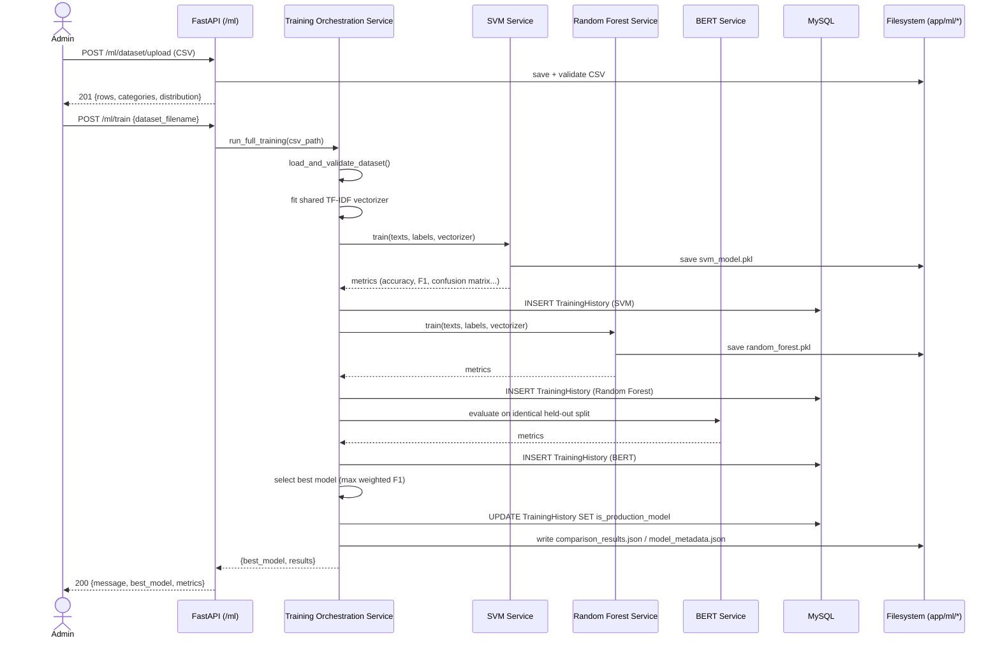

# System Diagrams

These diagrams use [Mermaid](https://mermaid.js.org/) syntax. They render
automatically on GitHub/GitLab, in most modern Markdown viewers, and in
the [Mermaid Live Editor](https://mermaid.live).

---

## (ER) Diagram

> `training_history` is intentionally not linked by foreign key to
> `evaluations` / `predictions` — it tracks model training runs
> independently of individual student submissions.

---

## 2. Architecture Diagram

---

## 3. Sequence Diagram — Student Submits an Evaluation

---

## 4. Sequence Diagram — Admin Trains & Compares Models

